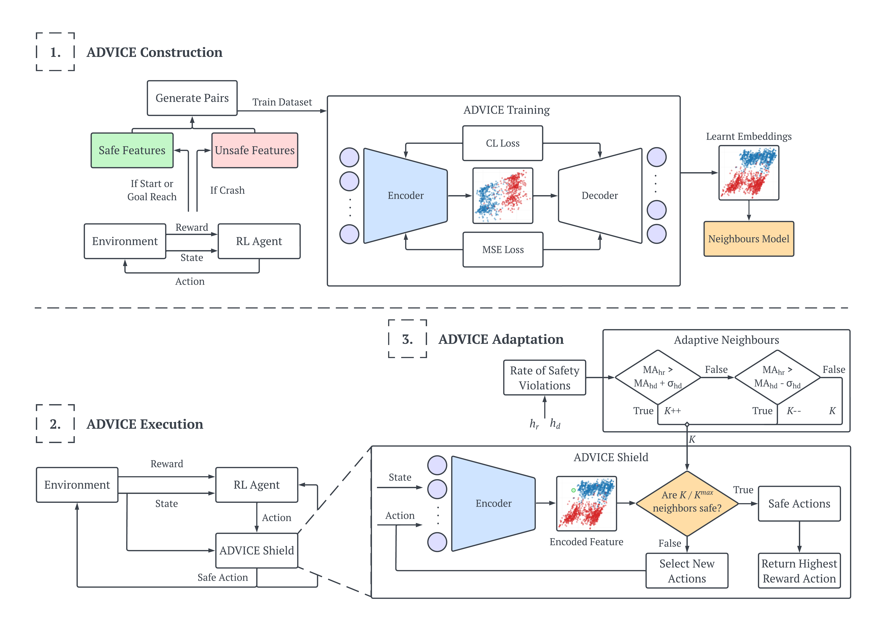

# ADVICE: Adaptive Shielding with a Contrastive Autoencoder
This repository contains code from our paper - 'Safe Reinforcement Learning in Black-Box Environments via Adaptive Shielding'.

### Introduction
Empowering safe exploration of reinforcement learning (RL) agents during training is a critical impediment towards deploying RL agents in many real-world scenarios. Training RL agents in unknown, \textit{black-box} environments poses an even greater safety risk when prior knowledge of the domain/task is unavailable. We introduce ADVICE (Adaptive Shielding with a Contrastive Autoencoder), a novel post-shielding technique that distinguishes safe and unsafe features of state-action pairs during training, thus protecting the RL agent from executing actions that yield potentially hazardous outcomes. Our comprehensive experimental evaluation against state-of-the-art safe exploration techniques demonstrates how ADVICE can significantly reduce safety violations during training while maintaining a competitive outcome reward.

<p align="center">
  
</p>
<p align="center">Fig 1. A high-level overview of ADVICE including construction, execution, and adaptation.</p>

### ADVICE
ADVICE starts with collecting a dataset of state-action pairs, classified as either safe or unsafe based on the outcomes they lead to within the training environment. This dataset is then used to train the contrastive autoencoder. The training process leverages a unique loss function that helps the model learn by comparing similar (safe) and dissimilar (unsafe) pairs, enhancing its ability to identify and categorize new observations quickly. To classify unseen data, a nearest neighbours model is fit on the final embedding space.
 
Once trained, ADVICE operates by passing the current state and the desired action through the encoder and then classifying the unseen embeddings using the nearest neighbours model and a safety threshold k. If deemed safe, the RL agent can continue. If deemed unsafe, ADVICE will select the next best safe action. The parameter k denotes the conservativeness of the shield.
 
Adaptive ADVICE automatically adjusts the conservativeness of the safety threshold dynamically, based on the agent's recent performance. If the agent has been performing safely, the system can allow more exploratory actions; conversely, if safety violations increase, the system becomes more conservative.

### Getting Started
To get started you can run the `main.py` file from our source code. To run ADVICE in the [safety gymnasium](https://github.com/PKU-Alignment/safety-gymnasium) test suite, it is required you run the following pip commands:

```
wget https://github.com/PKU-Alignment/safety-gymnasium/archive/refs/heads/main.zip
unzip main.zip
cd safety-gymnasium-main
pip install -e .
```

to locally download the test suite. The following libraries and packages are required:

```
numpy==1.23.4
tensorflow==2.4.1
pandas==2.0.3
plotly==5.18.0
seaborn==0.13.0
scikit-learn==1.2.1
tqdm==4.66.1
```

To then run ADVICE, you can run the `main.py` file using the following command:

```
python main.py
```

You can refer to the [safety gymnasium](https://github.com/PKU-Alignment/safety-gymnasium) repo for more details on installation, usage, and customisation.

### Files
This repository contains the following files:
* `src/`
  * `encoder_shield\adpt\shield.py` - The main source code behind our method. This includes the Adaptive ADVICE.
  * `buffer.py` - Source code for a replay buffer.
  * `noise.py` - Source code for the Ornstein-Uhlenbeck noise.
  * `main.py` - Source code for running the source code and saving results/models.
* `overview.png` - A high-level overview of ADVICE including training, inference, and the adaptive extension.
