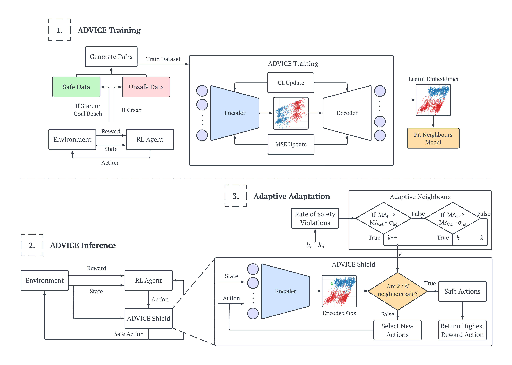

# ADVICE: Adaptive Shielding with a Contrastive Autoencoder
This repository contains code from our paper - 'Safe Exploration using Adaptive Shielding'.

### Introduction
Safe exploration of reinforcement learning (RL) agents during training is a critical concern, especially on the path to enabling RL agents in many real-world scenarios. Training RL agents in unknown, black-box environments poses an even greater safety risk when prior knowledge of the domain/task is unavailable. We introduce ADVICE (Adaptive Shielding with a Contrastive Autoencoder), a novel post-shielding technique that is able to distinguish safe and unsafe observations during training, thus protecting the RL agent from potentially hazardous exploration. Our experimental evaluation demonstrates how ADVICE can significantly reduce safety violations during training while maintaining a competitive episodic return.

<p align="center">
  
</p>
<p align="center">Fig 1. A high-level overview of ADVICE including training, inference, and the adaptive extension.</p>

### ADVICE
Add short methodology here...

### Getting Started
To get started you can run the `main.py` file from our source code. To run ADVICE in the [safety gymnasium](https://github.com/PKU-Alignment/safety-gymnasium) test suite, it is required you run the following pip command:

```
pip install safety-gymnasium
```

### Files
This repository contains the following files:
* `src/`
  * `encoder_shield\adpt\shield.py` - The main source code behind our method. This includes the adaptive shield extension.
  * `buffer.py` - Source code for a replay buffer.
  * `noise.py` - Source code for the Ornstein-Uhlenbeck noise.
  * `main.py` - Source code for running the source code and saving results/models.
* `overview.png` - A high-level overview of ADVICE including training, inference, and the adaptive extension.
